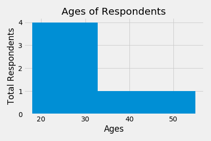
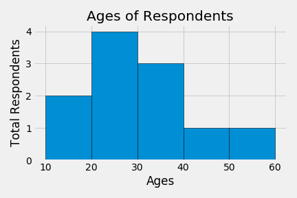
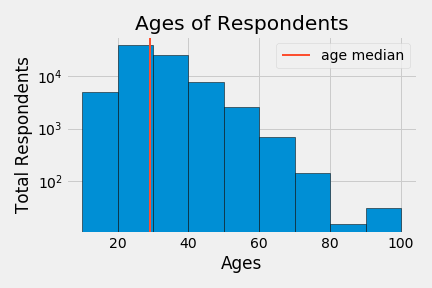
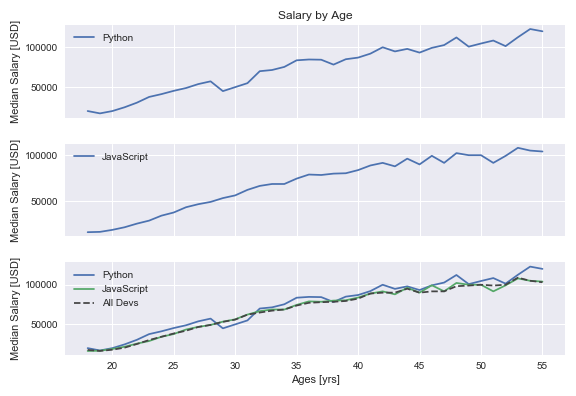

# Matplotlib  
https://matplotlib.org/  
https://matplotlib.org/tutorials/introductory/pyplot.html#sphx-glr-tutorials-introductory-pyplot-py  
https://matplotlib.org/gallery/index.html  
https://matplotlib.org/tutorials/introductory/sample_plots.html#sphx-glr-tutorials-introductory-sample-plots-py

Corey MS Schafer:  
https://www.youtube.com/playlist?list=PL-osiE80TeTvipOqomVEeZ1HRrcEvtZB_  
https://github.com/CoreyMSchafer/code_snippets/tree/master/Python/Matplotlib

Real python:  
https://youtu.be/SRgYGhRXVlY

## 01 Line plots  
https://www.youtube.com/watch?v=UO98lJQ3QGI&list=PL-osiE80TeTvipOqomVEeZ1HRrcEvtZB_&index=1  
https://github.com/CoreyMSchafer/code_snippets/tree/master/Python/Matplotlib/01-Introduction  
   
 
 

### Line plots with fills  
https://www.youtube.com/watch?v=x0Uguu7gqgk&list=PL-osiE80TeTvipOqomVEeZ1HRrcEvtZB_&index=5  
https://github.com/CoreyMSchafer/code_snippets/tree/master/Python/Matplotlib/05-Fill_Betweens  
    
 
 
 

## 02 Bar charts  
https://www.youtube.com/watch?v=UO98lJQ3QGI&list=PL-osiE80TeTvipOqomVEeZ1HRrcEvtZB_&index=2  
https://github.com/CoreyMSchafer/code_snippets/tree/master/Python/Matplotlib/02-BarCharts  
   
 
 

## 03 Pie charts  
https://www.youtube.com/watch?v=MPiz50TsyF0&list=PL-osiE80TeTvipOqomVEeZ1HRrcEvtZB_&index=3  
https://github.com/CoreyMSchafer/code_snippets/tree/master/Python/Matplotlib/03-PieCharts  
   
 
 

## 04 Stack plot  
https://www.youtube.com/watch?v=xN-Supd4H38&list=PL-osiE80TeTvipOqomVEeZ1HRrcEvtZB_&index=4  
https://github.com/CoreyMSchafer/code_snippets/tree/master/Python/Matplotlib/04-StackPlots  
https://youtu.be/SRgYGhRXVlY  
    
 
 
 

## 05 Histogram  
https://www.youtube.com/watch?v=XDv6T4a0RNc&list=PL-osiE80TeTvipOqomVEeZ1HRrcEvtZB_&index=6  
https://github.com/CoreyMSchafer/code_snippets/tree/master/Python/Matplotlib/06-Histograms  
    
 
 
 

## 06 Scatter plot  
https://www.youtube.com/watch?v=zZZ_RCwp49g&list=PL-osiE80TeTvipOqomVEeZ1HRrcEvtZB_&index=7  
https://github.com/CoreyMSchafer/code_snippets/tree/master/Python/Matplotlib/07-ScatterPlots  
    
 
 
 

## 07 Time series  
https://www.youtube.com/watch?v=_LWjaAiKaf8&list=PL-osiE80TeTvipOqomVEeZ1HRrcEvtZB_&index=8  
https://github.com/CoreyMSchafer/code_snippets/tree/master/Python/Matplotlib/08-TimeSeries  
   
 
 

## 08 Live data
https://www.youtube.com/watch?v=Ercd-Ip5PfQ&list=PL-osiE80TeTvipOqomVEeZ1HRrcEvtZB_&index=9  
https://github.com/CoreyMSchafer/code_snippets/tree/master/Python/Matplotlib/09-LiveData

## 09 Subplots  
https://www.youtube.com/watch?v=XFZRVnP-MTU&list=PL-osiE80TeTvipOqomVEeZ1HRrcEvtZB_&index=10  
https://github.com/CoreyMSchafer/code_snippets/tree/master/Python/Matplotlib/10-Subplots  
  
 
